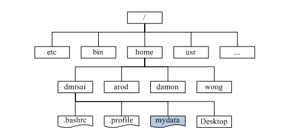

Linux 操作系统
==========================

| Tedu Python 教学部 |
| --- |
| Author：吕泽|
| Days：1天|

-----------

[TOC]

## Linux 操作系统及其组成

1. 操作系统的作用

操作系统（OS）是管理计算机硬件与软件资源的计算机程序，同时也是计算机系统的内核与基石。操作系统需要处理如管理与配置内存、决定系统资源供需的优先次序、控制输入设备与输出设备、操作网络与管理文件系统等基本事务。操作系统也提供一个让用户与系统交互的操作界面。

2. Linux操作系统组成

 一个典型的Linux操作系统组成为：Linux内核，文件系统，命令行shell，图形界面和桌面环境，并包各种工具和应用软件。

 * Linux内核: Linux操作系统的核心代码
  
 * 文件系统：通常指称管理磁盘数据的系统，可将数据以目录或文件的型式存储。每个文件系统都有自己的特殊格式与功能

 * shell命令： 接收用户命令，然后调用相应的应用程序，并根据用户输入的指令来反馈给用户指定的信息。

## shell命令

### 文件操作命令

* linux下的目录结构

| 作用 | 命令 |
| --- | --- |
| 切换工作目录 | cd |
| 查看文件 | ls  ，  ls -l ，  ls -a |
| 复制文件 | cp  -r |
| 移动文件 | mv |
| 删除文件 | rm  -rf  ， rmdir |
| 创建文件夹| mkdir -p |
| 创建文件| touch |
| 查看文件内容| cat |

### 软件管理

| 作用 | 命令 |
| --- | --- |
| 升级软件包 | apt-get   update |
| 安装软件   | apt-get   install   |
| 卸载软件   | apt-get   remove  --purge  |

## ssh服务

ssh是一种安全协议，主要用于给远程登录会话数据进行加密，保证数据传输的安全。在数据传输方面有很多应用。

### Linux下的SSH服务

>在Linux下SSH服务端是一个在后台运行的程序，响应来自客户端的连接请求。 SSH服务端的讲程名为sshd，负责实时监听远程SSH客户端的远程连接请求，并进行处理。

* 安装 ： sudo apt-get install openssh-server

* 查看ssh服务状态 ： ps -e|grep ssh

* 启动和关闭 ： sudo service ssh start/restart/stop
              /etc/init.d/ssh start/restart/stop

### ssh命令

#### ssh登录远程主机

> ssh [-p port] username@ip
> 退出： exit 或 ctrl-D

#### scp命令

scp命令可以用来通过安全、加密的连接在机器间传输文件。

>把本地文件传输给远程系统：
scp localfile  username@tohostname:/newfilename 

>把远程文件传输给本地系统：
scp username@tohostname:/remotefile /localfile 

### ssh秘钥

每次登录远程主机都需要输入密码是很不便捷的，如果要加速这一步骤，可以利用密钥对进行连接，主要思路是：生成一对公钥私钥，私钥在local主机上，公钥在远程服务器上，每次建立ssh连接自动检查密钥对是否匹配。

#### 生产ssh秘钥步骤
>> 1. 生产秘钥对 ： ssh-keygen  执行以后会在主目录下生成一个.ssh文件夹,其中包含私钥文件id_rsa和公钥文件id_rsa.pub。
>> 2. 在服务器主机上将id_rsa.pub文件的内容附加~/.ssh/authorized_keys文件中，并修改器权限。

## 编译器使用

### vim使用

Vim是一个类似于Vi的著名的功能强大、高度可定制的文本编辑器，在Vi的基础上改进和增加了很多特性.

#### Vim简单实用

> 操作命令
>* i  在当前字符的左边插入
>* o  在当前行下面插入一个新行
>* h  向前移动一个字符
>* j  向上移动一行
>* k  向下移动一行
>* l  向后移动一个字符
>* yy 复制当前一行
>* dd 剪切当前一行
>* p  粘贴内容到游标之后

>底行命令
>* :w 保存
>* :q 退出
>* :q!  强行退出